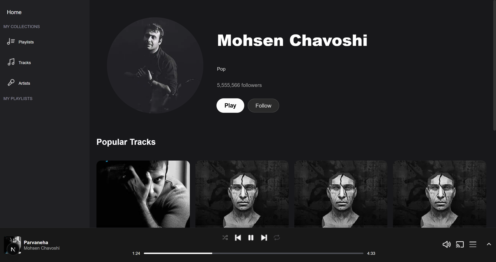
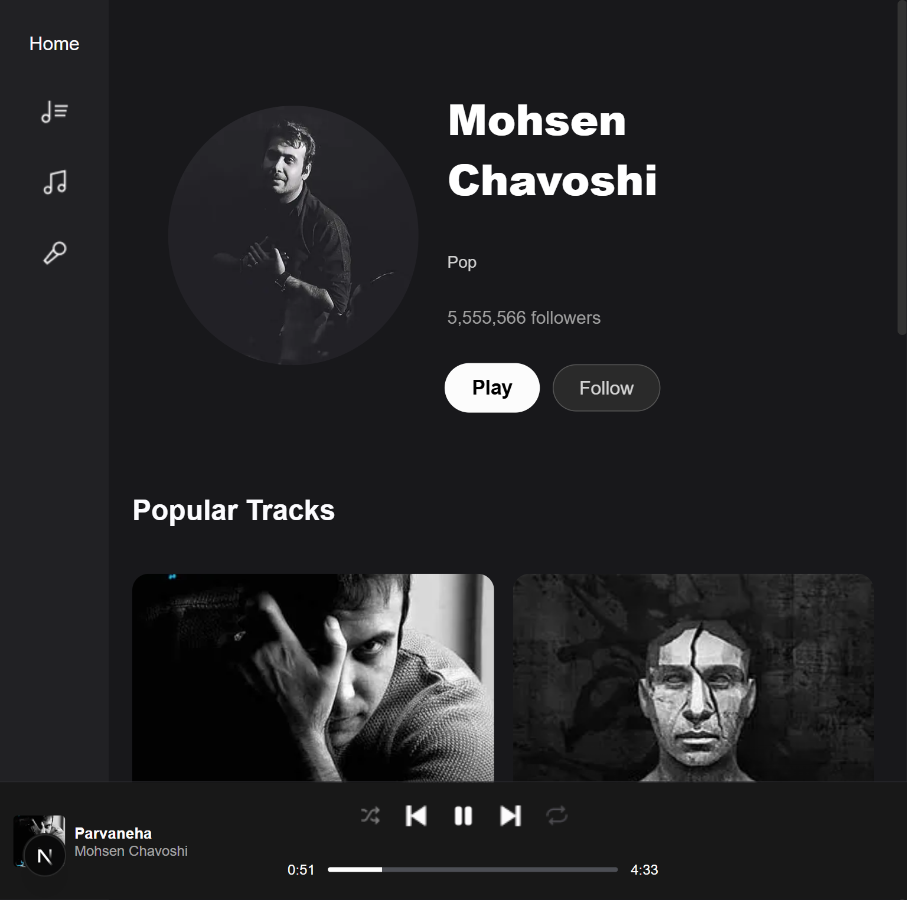
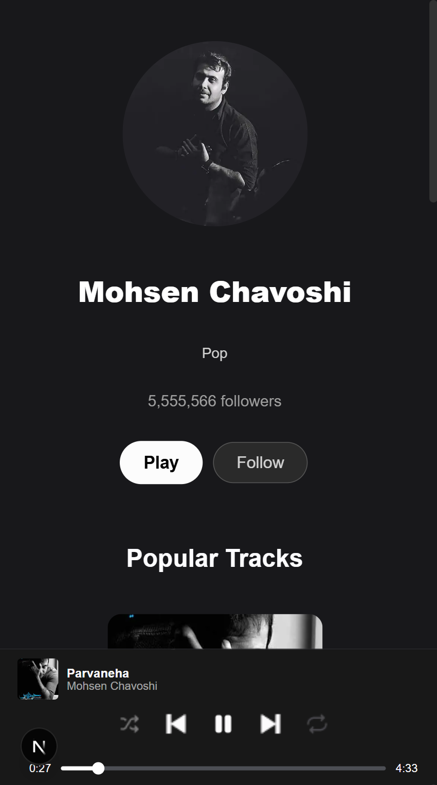
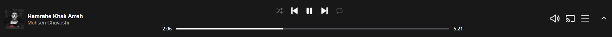

# Wavefy 🎧

A modern **music streaming web application** inspired by Spotify, built as a **portfolio-ready project** to demonstrate real-world front-end architecture, state management, and responsive UI design.

Wavefy focuses on clean UX, scalable structure, and production-level patterns using **Next.js App Router**.

---

## ✨ Features

* 🎵 Play / Pause / Next / Previous tracks
* 🔁 Repeat & 🔀 Shuffle support
* 📃 Queue management with source awareness (playlist / single / artist)
* 🧠 Global audio state handled via Redux Toolkit
* 📱 Fully responsive design (Desktop / Tablet / Mobile)
* 👆 Touch-friendly horizontal scrolling on mobile (no hover dependency)
* 🎨 Smooth animations & transitions
* 🧩 Reusable and scalable component architecture

---

## 🧱 Tech Stack

* **Framework:** Next.js (App Router)
* **Language:** TypeScript
* **State Management:** Redux Toolkit
* **Styling:** SCSS Modules
* **Media Handling:** HTML5 Audio API
* **Routing:** Next.js dynamic routes

---

## 📱 Responsive Design

Wavefy is designed with a **mobile-first mindset**:

* Desktop: Grid-based layouts with hover interactions
* Tablet: Reduced columns, icon-focused UI
* Mobile:

  * Smaller cards
  * Always-visible play button (no hover)
  * Horizontal swipe scrolling instead of arrows

Breakpoints used:

```scss
$mobile: 480px;
$tablet: 768px;
$desktop: 1280px;
```

---

## 🖼 Screenshots

### Desktop



### Tablet



### Mobile



### Player Bar



---

## 🧠 Architecture Highlights

* Separation of **UI & Logic** via hooks
* Audio side-effects handled outside components
* Redux state normalized for scalability
* Reusable card components (Track / Playlist / Artist)
* Consistent responsive rules across the app

---

## 🚀 Getting Started

Clone the repository:

```bash
git clone https://github.com/ali-najari/wavefy.git
cd wavefy
```

Install dependencies:

```bash
npm install
```

Run the development server:

```bash
npm run dev
```

Open [http://localhost:3000](http://localhost:3000) in your browser.

---

## 📌 Project Purpose

This project was built to:

* Demonstrate **real-world front-end skills**
* Showcase **state management with Redux Toolkit**
* Apply **responsive design principles** correctly
* Serve as a **portfolio / resume project**

---

## 🛠 Future Improvements

* Authentication & user playlists
* Backend integration (API / database)
* Search functionality
* Volume & equalizer enhancements

---

## 👤 Author

**Ali-Najari**
Junior Front-End Developer

---

⭐ If you like this project, feel free to star the repository!
